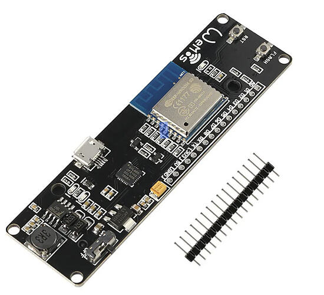

# ESP-WROOM-02

    

## Descripcion general

* Version : V1.0
* Brand: WeMos
* A convenient Micro USB connection
* Operation and charging are possible at the same time
* 18650 charging circuit including the 5V boosting circuit with TP5400
* CP2102 USB Serial Converter and Programming Control Electronics
* Compatible with Arduino IDE
* Compatible with NodeMCU
* On Board 3.3V Regulator
* RESET and FLASH buttons
* Built-in LED (Blue Color): Connected on ESP-WROOM-02 Pin 17 / IO16 (WeMos D0)
* SOLDER terminal for SLEEP MODE

## Pinout

La siguiente tabla lista como los pines de la tarjeta son conectados.

| Pin   | No    | Pin Name | ESP-WROOM-02 Pin	ESP-WROOM-02 FUNCTION |
| :---- | :-----| :------- | :----------------------------------------|
| 1	    | A0	| 16	   | TOUT / A0                                |
| 2	    | D1	| 14	   | IO5 / I2C-SCL                            |
| 3	    | D2	| 10	   | IO4/I2C-SDA                              |
| 4	    | D3	| 8	       | IO0                                      |
| 5	    | D4	| 7	       | IO2 / UART1_TXD                          |
| 6	    | D5	| 3	       | IO14 / HSPI_CLK                          |
| 7	    | D6	| 4	       | IO12 / HSPI_MISO                         |
| 8	    | D7	| 5	       | IO13 / HSPI_MOSI / UART_CTS              |
| 9	    | D8	| 6	       | IO15 / HSPI_CS / UART_RTS                |
| 10	| RX	| 11	   | UART0_RXD / IO3                          |
| 11	| TX	| 12	   | UART0_TXD / IO1                          |
| 12	| 3V3	| 1	       |                                          |
| 13	| 5V	| N/A      |	                                      |
| 14	| GND	| 9        |	                                      |

## Proyectos

La siguiente lista contiene los proyectos en los que se uso la tarjeta.

* [mqtts google cloud iot + 4 variables aleatorias + rele](./projects/MQTTS%20(GCP)%20+%204VA%20Random%20+%20Rele/MQTTS%20(GCP)%20+%204VA%20Random%20+%20Rele.ino)
* [mqtts google cloud iot + rele](<projects/MQTTS (GCP) + Rele/MQTTS (GCP) + Rele.ino>)
* [mqtts google cloud iot + sensor C02](<projects/MQTTS (GCP) + SENSOR CO2/MQTTS (GCP) + SENSOR CO2/MQTTS (GCP) + SENSOR CO2.ino>)
* [mqtts google cloud iot + sensor nivel HC-SR04](<projects/MQTTS (GCP) + SENSOR NIVEL HC-SR04/MQTTS (GCP) + SENSOR HC-SR04/MQTTS (GCP) + SENSOR HC-SR04.ino>)
* [mqtts google cloud iot + sensor temperatura DS18B20](<projects/MQTTS (GCP) + SENSOR TEMPERATURA DS18B20/MQTTS (GCP) + SENSOR DS18B20/MQTTS (GCP) + SENSOR DS18B20.ino>)

* [mqtts google cloud iot + sensor vibracion](<projects/MQTTS (GCP) + SENSOR VIBRACION/MQTTS (GCP) + SENSOR VIBRACION/MQTTS (GCP) + SENSOR VIBRACION.ino>)